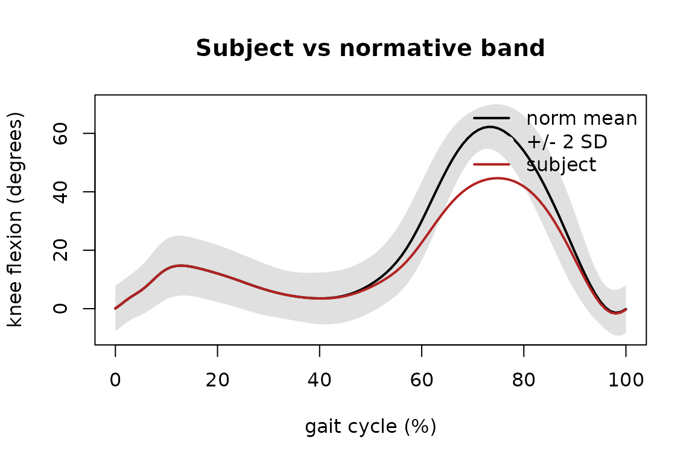

# Comparing a subject against normative gait bands

PhysioGaitNorm bundles **real** normative gait reference data: mean and
standard-deviation kinematic waveform bands over the gait cycle for the
nine Gait Deviation Index / Gait Profile Score variables, derived from
the public WBDS dataset (Fukuchi, Fukuchi & Duarte 2018; 24 young
healthy adults, overground comfortable-speed walking). This vignette
loads the bundled norms and compares a **synthetic** subject against
them — everything runs offline from the installed package data.

``` r

library(PhysioGaitNorm)
#> PhysioGaitNorm v0.2.1 - normative gait reference database
```

## The bundled datasets

[`listGaitNorms()`](https://x-biosignal.github.io/PhysioGaitNorm/reference/listGaitNorms.md)
returns the provenance / version manifest.

``` r

listGaitNorms()[, c("dataset", "version", "population", "n_subjects", "speed")]
#> Normative gait datasets (1):
```

[`loadGaitNorm()`](https://x-biosignal.github.io/PhysioGaitNorm/reference/loadGaitNorm.md)
loads the mean/SD bands. Each is a `variables x cycle-points` matrix
(rows named by kinematic variable, columns by cycle percentage).

``` r

norm <- loadGaitNorm("adult_reference", cycle = 101)
norm
#> <gait_norm>adult_referencev2.0.0
#>   cycle length : 101 points
#>   variables    : 9 (pelvic_tilt, pelvic_obliquity, pelvic_rotation, hip_flexion, hip_adduction, hip_rotation, knee_flexion, ankle_dorsiflexion, foot_progression)
#>   bands        : mean/sd, 9 x 101
#>   features     : 24 x 459
#>   population   : healthy_adult_young (age 21-37, self_selected)
norm$variables
#> [1] "pelvic_tilt"        "pelvic_obliquity"   "pelvic_rotation"   
#> [4] "hip_flexion"        "hip_adduction"      "hip_rotation"      
#> [7] "knee_flexion"       "ankle_dorsiflexion" "foot_progression"
```

## Comparing a synthetic subject to the knee-flexion band

We build a synthetic subject by taking the normative mean knee-flexion
waveform and reducing its swing-phase peak — a “stiff-knee” pattern —
then score each cycle point as a z-score against the normative mean and
SD.

``` r

pct   <- norm$percent
mu    <- norm$mean["knee_flexion", ]
sdev  <- norm$sd["knee_flexion", ]

# synthetic subject: normative mean minus a swing-phase bump (degrees)
subject <- mu - 18 * exp(-((pct - 72)^2) / (2 * 9^2))

z <- (subject - mu) / sdev
c(max_abs_z = round(max(abs(z)), 2),
  at_percent = pct[which.max(abs(z))])
#>  max_abs_z at_percent 
#>        4.9       72.0
```

The largest deviation falls in swing phase, as expected. A plot makes
the subject’s departure from the normal band explicit.

``` r

plot(pct, mu, type = "l", lwd = 2, ylim = range(mu - 2 * sdev, mu + 2 * sdev, subject),
     xlab = "gait cycle (%)", ylab = sprintf("knee flexion (%s)", norm$units),
     main = "Subject vs normative band")
polygon(c(pct, rev(pct)), c(mu + 2 * sdev, rev(mu - 2 * sdev)),
        col = "grey88", border = NA)
lines(pct, mu, lwd = 2)
lines(pct, subject, col = "firebrick", lwd = 2)
legend("topright", c("norm mean", "+/- 2 SD", "subject"),
       col = c("black", "grey88", "firebrick"), lwd = c(2, 8, 2), bty = "n")
```



## Where next

The same `norm$mean` / `norm$sd` bands drive the Gait Deviation Index
and Gait Profile Score calculations elsewhere in the ecosystem; the
per-subject feature matrix (`loadGaitNorm(features = TRUE)$features`) is
the normative population used to build the GDI basis. See
[`?loadGaitNorm`](https://x-biosignal.github.io/PhysioGaitNorm/reference/loadGaitNorm.md)
and the provenance manifest in
[`listGaitNorms()`](https://x-biosignal.github.io/PhysioGaitNorm/reference/listGaitNorms.md)
for full data lineage and citations.
